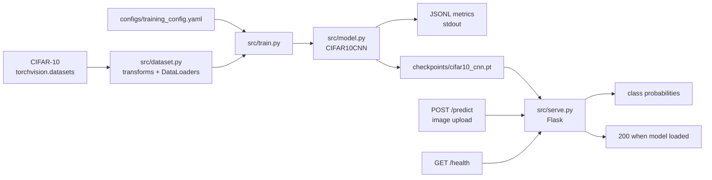

# MLOps PyTorch Image Classifier

A small end-to-end CIFAR-10 image classification pipeline built with PyTorch. It includes a convolutional neural network, torchvision data loading, configurable training with early stopping, checkpoint persistence, and a Flask prediction API.

## Architecture



## Project layout

```text
configs/training_config.yaml  Training and output settings
src/model.py                  CNN model factory
src/dataset.py                CIFAR-10 datasets and DataLoaders
src/train.py                  Training and checkpointing
src/serve.py                  Flask inference API
tests/                        Automated tests
requirements/                 Training and serving dependencies
```

## Requirements

- Python 3.11 or newer
- CPU or CUDA-capable PyTorch environment
- Internet access on the first training run so torchvision can download CIFAR-10

Create and activate a virtual environment from the repository root:

```bash
python3 -m venv .venv
source .venv/bin/activate
python -m pip install --upgrade pip
```

Install dependencies for training:

```bash
python -m pip install -r requirements/train.txt
```

Install serving dependencies when running the API:

```bash
python -m pip install -r requirements/serve.txt
```

## Train the model

Training reads `configs/training_config.yaml`. The default configuration uses CIFAR-10, batch size 64, a learning rate of `0.001`, up to 20 epochs, and early stopping after 3 epochs without validation-loss improvement.

```bash
python src/train.py
```

The first run downloads the dataset into `data/`. Training prints one JSON object per epoch, for example:

```json
{"epoch": 1, "train_loss": 1.42, "train_accuracy": 0.49, "val_loss": 1.18, "val_accuracy": 0.58}
```

The best checkpoint is written to:

```text
checkpoints/cifar10_cnn.pt
```

Change `data.data_dir`, training values, or `output.checkpoint_dir` and `output.model_name` in the YAML file to customize the run.

## Run the prediction API

After a checkpoint has been created:

```bash
MODEL_CHECKPOINT=checkpoints/cifar10_cnn.pt python src/serve.py
```

The server listens on `http://localhost:8080` by default. Set `PORT` to use another port.

Check model health:

```bash
curl http://localhost:8080/health
```

Classify an image using a multipart upload. The image is converted to RGB and preprocessed with the same evaluation normalization used during validation. CIFAR-10 inputs are 32x32 pixels:

```bash
curl -X POST http://localhost:8080/predict \
	-F "image=@path/to/image.png"
```

The response contains the CIFAR-10 class names and a probability for each class:

```json
{
	"classes": ["airplane", "automobile", "bird", "cat", "deer", "dog", "frog", "horse", "ship", "truck"],
	"probabilities": [0.01, 0.02, 0.03, 0.04, 0.05, 0.70, 0.04, 0.03, 0.04, 0.04]
}
```

The endpoint also accepts an image as the raw request body:

```bash
curl -X POST http://localhost:8080/predict \
	-H "Content-Type: image/png" \
	--data-binary @path/to/image.png
```

## Run tests and CI checks

Run the local test suite:

```bash
python -m pytest -q
```

The GitHub Actions workflow in `.github/workflows/ci.yml` runs on pushes and pull requests. It installs dependencies, compiles the Python sources, validates the training configuration, and runs pytest without starting a training job or downloading the dataset.